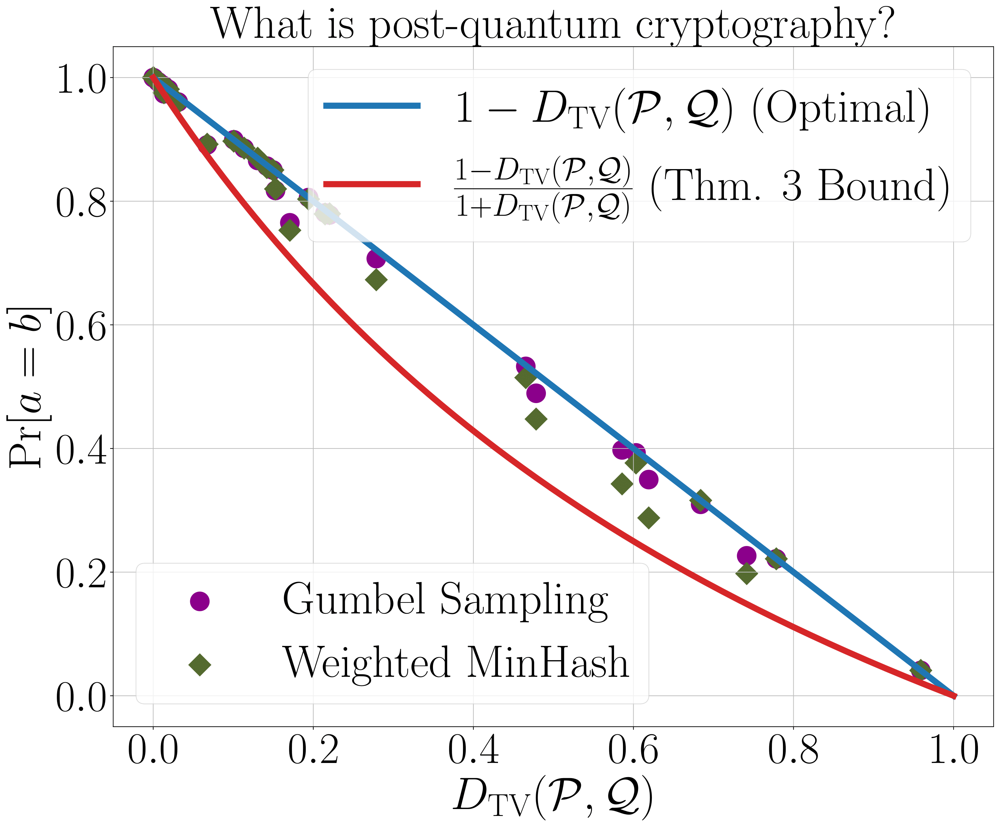
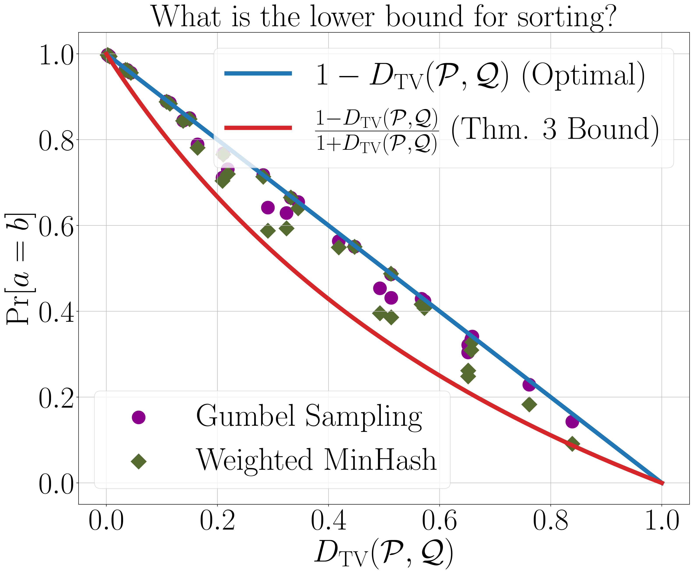

# DISD (Drafter-Invariant Speculative Decoding)

Drafter-Invariant Speculative Decoding (DISD) is a pioneering framework designed to explore and evaluate the effectiveness of our proposed coupling methods—`Gumbel Sampling` and `Weighted MinHash`—in generating coordinated samples from token distributions of language models. DISD meticulously examines how large-scale models generate text sequences and assesses how well smaller, drafter models can approximate these sequences under our coupling protocols, without direct communication between the drafter and the main model.

A distinctive advantage of DISD over standard speculative decoding methods is its ability to maintain the independence of the main model's output from the smaller drafter model. Typically, speculative decoding can lead to outputs that vary based on the drafter model's behavior. In contrast, our method ensures that the output of the language model (LM) remains invariant, fixed by a specific random seed. This key feature preserves the deterministic nature of outputs, which is crucial for reproducibility, facilitates easier unit testing, and simplifies debugging. By addressing and circumventing the inherent limitations of standard speculative decoding, DISD sets a new standard in ensuring model output reliability while harnessing advanced decoding techniques.
## Requirements

Before running the scripts, ensure you have Python and the necessary libraries installed. Install the required packages using pip:

```bash
pip install torch transformers pandas matplotlib
```

### Generating Model Distributions
Generate token distributions for a specific text across different models using the `generate_model_distribution.py` script:
```bash
python generate_model_distribution.py --model_large google/gemma-2-27b-it \
 --model_medium google/gemma-2-9b-it \
 --model_small google/gemma-2-2b-it \
 --input_text "What is the Traveling Salesman Problem (TSP)?" \
 --num_tokens 32 
```

### Analyzing Coupling
Analyze the coupling between the large and small models using Gumbel Sampling and Weighted MinHash:

```bash
python plot_coupling_bounds.py --model_large gemma-2-27b-it\
 --model_small gemma-2-2b-it \
 --input_text "What is the lower bound for sorting?" \
 --num_tokens 32 \
 --num_retries 20000
```

|  |  | .png) |
|:------------------------------------------------------:|:--------------------------------------------------------:|:-----------------------------------------------------------------:|

Each execution compares the token distributions from the large model ($\mathcal{Q}$) and the drafter model ($\mathcal{P}$), using the `Gumbel Sampling` and `Weighted MinHash` methods over 20,000 repetitions. The script plots the frequency of identical token generation, where $a = b$, and compares this to the total variation distances of the distributions at each token position.


### Citation